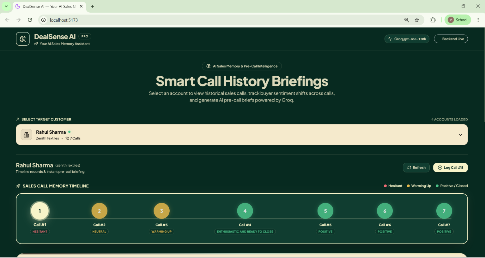
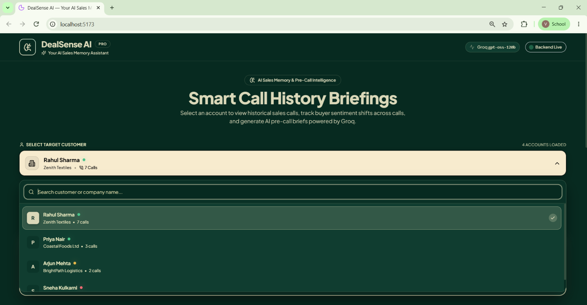
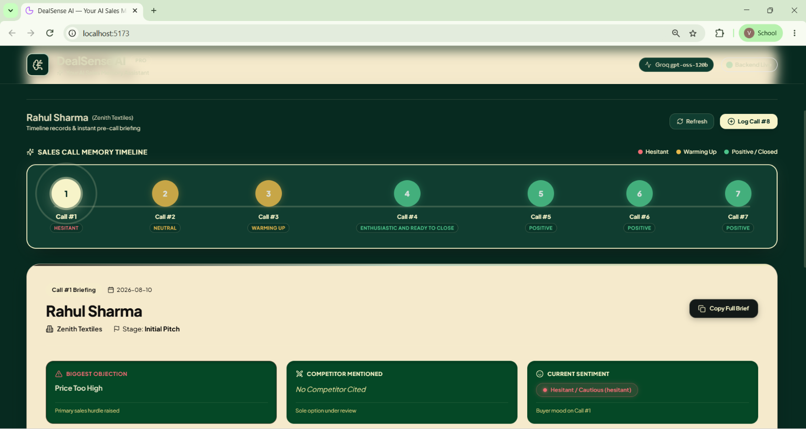
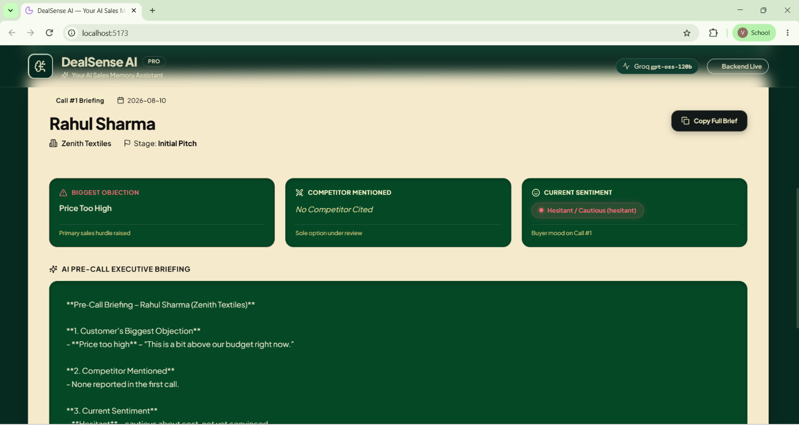
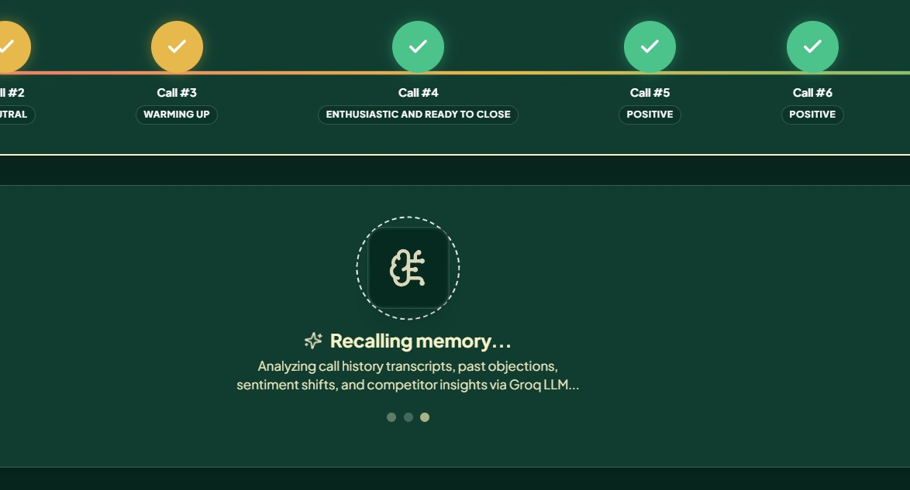
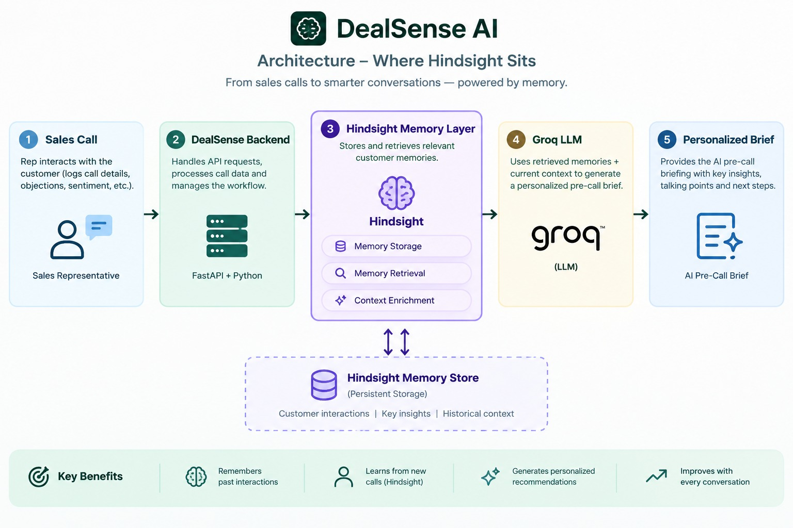

# 💼 DealMind — AI Deal Intelligence Agent

DealMind is an AI-powered sales intelligence application that helps sales teams prepare for customer conversations by remembering important information from previous calls.

Instead of treating every customer conversation as isolated, DealMind uses Hindsight as a long-term memory layer to retain and recall important deal information such as objections, competitors, customer preferences, sentiment, quotes, and next steps.

Groq is used as the LLM layer to analyze the conversation history and generate a concise pre-call intelligence brief.

---

## 🧠 1. What DealMind Does

The application follows this flow:

📞 Customer Call

↓

💾 Save Call

↓

🧩 Analyze / Structure Call Information

↓

🧠 Hindsight Long-Term Memory

↓

🔍 Recall Relevant Customer History

↓

🤖 Groq LLM

↓

📋 Pre-Call Intelligence Brief

---

## 📸 Screenshots

### 🖥️ 1. Dashboard




### 👤 2. Customer Details




### 📞 3. Call History




### 📋 4. Pre-Call Intelligence Brief




### 🧠 5. Hindsight Memory



---

## 🏗️ 2. Architecture

---

## 🛠️ 3. Tech Stack

### 🎨 Frontend

React  
Vite  
JavaScript  
HTML  
CSS  

### ⚙️ Backend

Python  
FastAPI  
Uvicorn  

### 🤖 AI

Groq  
Hindsight  

### 💾 Data / Utilities

JSON  
Requests  
Pydantic  
python-dotenv  
aiohttp  

---

## 📁 4. Project Structure

deal-intelligence-agent/

│

├── backend/

│   ├── main.py

│   ├── requirements.txt

│   ├── .env

│   ├── .gitignore

│   │

│   ├── services/

│   │   ├── ai_service.py

│   │   └── hindsight_service.py

│   │

│   ├── data/

│   │   └── mock_calls.json

│   │

│   ├── test_groq.py

│   └── test_hindsight.py

│

├── frontend/

│   ├── src/

│   ├── public/

│   ├── package.json

│   └── vite.config.js

│

└── README.md

---

## 📋 5. Requirements

### ⚙️ Backend Requirements

Python 3.10+

pip

Virtual environment

Groq API key

Hindsight API key

### 🎨 Frontend Requirements

Node.js

npm

### 🔎 Check Your Installations

python --version

pip --version

node --version

npm --version

---

## 📥 6. Clone the Project

git clone https://github.com/chinthalasneha/deal-intelligence-agent

Enter the project:

cd deal-intelligence-agent

---

## ⚙️ 7. Backend Setup

Go to the backend:

cd backend

Create a virtual environment:

python -m venv venv

Activate it:

.\venv\Scripts\Activate.ps1

After activation, your terminal should look similar to:

(venv) PS C:\Users\Rishika\...\deal-intelligence-agent\backend>

---

## 📦 8. Install Backend Dependencies

The requirements.txt file contains:

fastapi

uvicorn

requests

python-dotenv

pydantic

groq

hindsight-client

aiohttp

Install them:

python -m pip install -r requirements.txt

Or install manually:

python -m pip install fastapi uvicorn requests python-dotenv pydantic groq hindsight-client aiohttp

---

## 🔑 9. Groq Setup

Create a Groq API key from your Groq account.

Store it in the backend `.env` file.

⚠️ Do not put the key directly inside Python code.

---

## 🧠 10. Hindsight Setup

DealMind uses Hindsight as its long-term memory engine.

Create a Hindsight Cloud account and create:

- 🏢 Organization
- 🧠 Memory bank
- 🔑 API key

The memory bank used by this project is:

`dealsense-sales`

The Hindsight API endpoint is:

`https://api.hindsight.vectorize.io`

---

## 🔐 11. Environment Variables

Create:

`backend/.env`

Add:

GROQ_API_KEY=your_groq_api_key

GROQ_MODEL=openai/gpt-oss-120b

HINDSIGHT_API_KEY=your_hindsight_api_key

HINDSIGHT_BASE_URL=https://api.hindsight.vectorize.io

HINDSIGHT_BANK_ID=dealsense-sales

### ⚠️ Important

Never commit `.env` to GitHub.

Your `.gitignore` should contain:

.env

*.env

venv/

__pycache__/

---

## 🧪 12. Verify Groq

From the backend directory with the virtual environment activated:

python test_groq.py

A successful response confirms that the Groq API and configured model are working.

---

## 🧪 13. Verify Hindsight

Run:

python test_hindsight.py

This test verifies the Hindsight client, authentication, memory bank, retention, and recall functionality used by the project.

---

## 🧠 14. How Hindsight Works in DealMind

Hindsight acts as the long-term episodic memory engine.

The application has two main memory operations:

### 💾 RETAIN

↓

Store important information from a call

### 🔍 RECALL

↓

Retrieve relevant information before another call

---

## 📞 14.1 When a Call Is Saved

The flow is:

👤 User logs call

↓

`POST /save-call`

↓

🧩 Create structured memory statement

↓

💾 Hindsight RETAIN

↓

🧠 Memory stored in `dealsense-sales`

The backend converts the call into an information-dense memory statement.

Example:

```python
memory_statement = (
    f"Customer {c_name} from {c_company} "
    f"(Stage: {c_stage}, Sentiment: {c_sentiment}). "
    f"Objection raised: {c_objection}. "
    f"Competitor mentioned: {c_competitor}. "
    f"Key quote: \"{c_quote}\". "
    f"Next step: {c_next}."
)

## The memory is associated with the customer and company.

Example:

👤 Customer: Rahul Sharma

🏢 Company: Zenith Textiles

⚠️ Objection: Pricing

🏆 Competitor: FabricFlow

💬 Sentiment: Hesitant

💡 15. Why Store Structured Memories?

### Instead of sending every historical conversation to the LLM every time, DealMind stores important information as persistent memory.

This allows the system to remember things such as:

👤 Customer preferences
⚠️ Objections
🏆 Competitors
💰 Pricing concerns
💬 Important quotes
😊 Sentiment
📋 Requirements
🤝 Commitments
➡️ Next steps

This also reduces the need to repeatedly place the entire conversation history into the LLM prompt.

🔍 16. Hindsight Recall

When the salesperson requests a pre-call brief:

👤 User opens customer

↓

GET /brief/{customer_name}/{up_to_call_number}

↓

🔍 Hindsight RECALL

↓

🧠 Relevant customer memories

↓

🤖 Groq

↓

📋 Pre-call brief

The backend sends a semantic query such as:

query = (
    f"What key preferences, objections, competitors, "
    f"or details are known about {customer_name} "
    f"from {company_name}?"
)

Hindsight searches the stored memories for relevant information.

🤖 17. Memory + Groq

The recalled Hindsight information is added to the Groq prompt.

The prompt contains two major sources of information:

📞 CALL HISTORY

Call 1

Call 2

Call 3

🧠 HINDSIGHT MEMORY
Previous pricing objection
Competitor mentioned
Customer preference
Previous commitment
Important quote

↓

🤖 Groq generates the final pre-call intelligence brief.

🔄 18. Complete AI Flow

📞 Customer Conversation

↓

📝 Structured Call Information

↓

💾 Hindsight RETAIN

↓

🧠 Long-Term Memory

↓

🔍 Hindsight RECALL

↓

📋 Relevant Deal Context

↓

🤖 Groq LLM

↓

🎯 Pre-Call Intelligence Brief

👤 19. Customer Isolation

DealMind associates memories with the relevant customer and company.

For example:

👤 Customer A

↓

🏢 Company A

↓

🧠 Relevant memories

And:

👤 Customer B

↓

🏢 Company B

↓

🧠 Relevant memories

This helps prevent unrelated customer information from being included in another customer's context.

🛡️ 20. Graceful Fallback

The application is designed so that Hindsight failure does not necessarily stop the entire application.

If Hindsight is temporarily unavailable:

⚠️ Hindsight unavailable

↓

🔍 Recall returns empty context

↓

📞 Existing call history is used

↓

🤖 Groq still generates the brief

This gives the application a fallback path using the locally stored call history.

🚀 21. Running the Backend

From:

backend/

Activate the environment:

.\venv\Scripts\Activate.ps1

Start FastAPI:

uvicorn main:app --reload --port 8001

Backend:

http://127.0.0.1:8001

FastAPI documentation:

http://127.0.0.1:8001/docs

🎨 22. Running the Frontend

Open a second terminal.

Go to:

cd "C:\Users\Rishika\OneDrive\Desktop\deal-intelligence-agent\frontend"

Install frontend dependencies:

npm install

Start the frontend:

npm run dev

Vite will provide a URL similar to:

http://localhost:5173

🖥️ 23. Running the Complete Application

You need two terminals.

⚙️ Terminal 1 — Backend

cd "C:\Users\Rishika\OneDrive\Desktop\deal-intelligence-agent\backend"

.\venv\Scripts\Activate.ps1

uvicorn main:app --reload --port 8001

🎨 Terminal 2 — Frontend

cd "C:\Users\Rishika\OneDrive\Desktop\deal-intelligence-agent\frontend"

npm run dev

Then open the Vite URL in your browser.

🧪 24. Testing the Complete Flow
1️⃣ Add a Customer Call

Enter information such as:

👤 Customer: Rahul Sharma

🏢 Company: Zenith Textiles

📊 Stage: Evaluation

💬 Sentiment: Hesitant

⚠️ Objection: Pricing

🏆 Competitor: FabricFlow

💬 Quote: "Your pricing is higher than what we expected."

➡️ Next Step: Pricing discussion next week

2️⃣ Save the Call

The backend stores the call and sends the important information to Hindsight.

POST /save-call

↓

🧠 Hindsight RETAIN

3️⃣ Add Another Call

The customer may now say:

We like the product but need a better price.

That information is also retained.

4️⃣ Generate the Pre-Call Brief

The application performs:

🔍 Hindsight RECALL

↓

💰 Previous pricing concerns

↓

🏆 Competitor information

↓

💬 Customer sentiment

↓

🤝 Previous commitments

↓

🤖 Groq

5️⃣ Display the Brief

The frontend displays the generated intelligence for the salesperson.

📋 25. Example Pre-Call Intelligence

👤 Customer: Rahul Sharma

🏢 Company: Zenith Textiles

⚠️ Key Concerns
Pricing remains the primary objection.
Customer is comparing the product with FabricFlow.
💬 Customer Sentiment
Interested but price-sensitive.
📞 Previous Discussion
Customer requested better pricing.
Customer is evaluating alternatives.
🎯 Recommended Talking Points
Address pricing concerns.
Clarify the value provided by the product.
Understand the competitor's offer.
Confirm the next decision step.
🔌 26. API Flow

Important backend endpoints include:

GET /health

POST /save-call

POST /calls

GET /brief/{customer_name}/{up_to_call_number}

The exact available endpoints can be checked through:

http://127.0.0.1:8001/docs

🧠 27. Hindsight Memory Model

The architecture separates responsibilities:

📁 Local JSON

↓

📞 Chronological call history

↓

🧠 Hindsight

↓

🔍 Long-term semantic memory

↓

🤖 Groq

↓

💡 Reasoning + generation

↓

⚛️ React

↓

🖥️ User interface

This separation allows each component to focus on a specific task.

💡 28. Why Hindsight Is Used
Traditional Approach

Every new call

↓

📜 Send entire conversation history

↓

📦 Large prompt

↓

🤖 LLM

DealMind Approach

📞 Call

↓

🧩 Extract important information

↓

💾 Hindsight RETAIN

↓

🧠 Persistent memory

↓

🔍 RECALL relevant information

↓

🤖 Groq

The key idea is that memory becomes a separate system component instead of simply adding more conversation history to the prompt.

🛠️ 29. Troubleshooting
❌ Import "hindsight_client" could not be resolved

Make sure the virtual environment is active:

.\venv\Scripts\Activate.ps1

Then:

python -m pip install hindsight-client

❌ Import "aiohttp" could not be resolved

python -m pip install aiohttp

🔑 HINDSIGHT_API_KEY is missing

Check:

backend/.env

and make sure:

HINDSIGHT_API_KEY=your_key

exists.

❌ Groq model_not_found

Check:

GROQ_MODEL=openai/gpt-oss-120b

Make sure no additional text is present after the model name.

❌ Backend not connecting

Make sure FastAPI is running:

uvicorn main:app --reload --port 8001

Then check:

http://127.0.0.1:8001/docs

🔐 30. Security

Never commit API keys.

Do not put:

GROQ_API_KEY

HINDSIGHT_API_KEY

inside the React frontend.

Keep them in:

backend/.env

and add .env to .gitignore.

⚡ 31. Development Commands — Quick Reference
⚙️ Backend

cd backend

.\venv\Scripts\Activate.ps1

python -m pip install -r requirements.txt

uvicorn main:app --reload --port 8001

🤖 Test Groq

python test_groq.py

🧠 Test Hindsight

python test_hindsight.py

🎨 Frontend

cd frontend

npm install

npm run dev

🏗️ 32. Overall Architecture


                        ┌──────────────────────┐
                        │    React / Vite      │
                        │      Frontend        │
                        └──────────┬───────────┘
                                   │
                                   ▼
                        ┌──────────────────────┐
                        │    FastAPI Backend   │
                        └──────┬────────┬──────┘
                               │        │
                    ┌──────────┘        └───────────┐
                    ▼                               ▼
          ┌──────────────────┐             ┌──────────────────┐
          │ mock_calls.json  │             │    Hindsight     │
          │  Call History    │             │ Long-Term Memory │
          └──────────────────┘             └────────┬─────────┘
                                                     │
                                                     │ Recall
                                                     ▼
                                            ┌──────────────────┐
                                            │  Relevant Deal   │
                                            │     Context      │
                                            └────────┬─────────┘
                                                     │
                                                     ▼
                                            ┌──────────────────┐
                                            │      Groq        │
                                            │       LLM        │
                                            └────────┬─────────┘
                                                     │
                                                     ▼
                                            ┌──────────────────┐
                                            │  Pre-Call Brief  │
                                            └──────────────────┘
🎯 33. Key Idea

DealMind combines structured call history, persistent Hindsight memory, and Groq-based generation to give a sales agent continuity across customer conversations.

The important distinction is:

📞 Call History = What happened

🧠 Hindsight = What the system remembers

🤖 Groq = How the system reasons and communicates it

⚛️ React = How the salesperson interacts with it

This makes the agent capable of using information from earlier customer interactions rather than treating every call as a completely new conversation.

🚀 Built for AI-Powered Sales Intelligence

DealMind — Remember every deal. Prepare for every conversation.